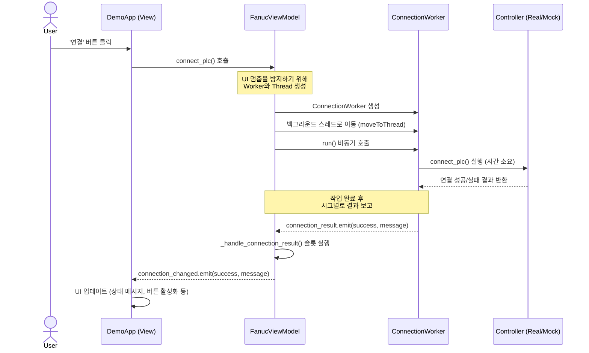

# PLC 연결 로직 설계

## 📂 폴더 구조 및 파일 역할

PLC 연결 로직은 UI의 반응성을 해치지 않도록 비동기적으로 처리되어야 한다. 이를 위해 MVVM 패턴과 Worker 스레드를 결합한 구조를 사용

```
KRISS_ROBOT_SYNC/
├── _client_demo/25.11.18/  # (참고) 현재 데모 코드 위치
│   ├── main.py
│   ├── fanuc_logic.py
│   ├── mock_model.py
│   ├── viewmodel.py
│   └── viewmodel_worker.py
│
└── main.py                # 1. 애플리케이션 시작 및 DLL 로드
```

*   **`main.py`**: 애플리케이션의 진입점. UI를 표시하기 전에, `pyads` 라이브러리가 필요로 하는 `TcAdsDll.dll` 파일을 로드하는 책임을 가진다. DLL 로드에 실패하면 앱은 시작되지 않습니다.

*   **`fanuc_logic.py` (PLC 컨트롤러)**: 실제 PLC와 통신하는 저수준(low-level) 로직을 담당합니다. `pyads` 라이브러리를 직접 사용하여 연결, 해제, 데이터 읽기/쓰기 등의 기능을 수행합니다.

*   **`mock_model.py` (Mock 컨트롤러)**: 실제 PLC 하드웨어 없이 개발 및 테스트를 진행하기 위한 가짜 컨트롤러입니다. `fanuc_logic.py`와 동일한 메서드(예: `connect_plc`)를 가지지만, 실제 통신 대신 `time.sleep()`으로 딜레이를 시뮬레이션하고 로그만 출력합니다.

*   **`viewmodel.py` (뷰모델)**: UI의 상태와 로직을 총괄합니다.
    *   '라이브 모드'와 '데모 모드' 상태를 관리하며, 현재 모드에 맞는 컨트롤러(`fanuc_logic` 또는 `mock_model`)를 선택합니다.
    *   UI로부터 '연결' 요청을 받으면, 직접 통신하지 않고 `ConnectionWorker`에게 작업을 위임합니다.
    *   Worker로부터 작업 결과를 보고받아 UI에 상태 변경을 알립니다.

*   **`viewmodel_worker.py` (워커)**: 시간이 오래 걸리는 작업을 백그라운드 스레드에서 실행하는 역할을 합니다.
    *   **`ConnectionWorker`**: PLC 연결 요청을 받아 백그라운드에서 `controller.connect_plc()`를 호출합니다. 이 덕분에 연결을 시도하는 동안 UI가 멈추지 않습니다. 작업이 완료되면 결과를 시그널(`connection_result`)로 ViewModel에 보고합니다.

## 🔄 로직 흐름 (Flowchart)

사용자가 '연결' 버튼을 클릭했을 때의 전체적인 비동기 처리 흐름입니다.



---

### 요약
1.  **View**는 요청만 보냅니다.
2.  **ViewModel**은 요청을 받아 Worker를 고용하고 일을 시킵니다.
3.  **Worker**는 별도의 공간(스레드)에서 시간이 걸리는 실제 작업을 수행합니다.
4.  작업이 끝나면 **Worker**는 ViewModel에게 보고하고, **ViewModel**은 View에게 상태를 업데이트하라고 지시합니다.

이 구조를 통해 오래 걸리는 작업 중에도 UI는 항상 부드럽게 동작할 수 있습니다.