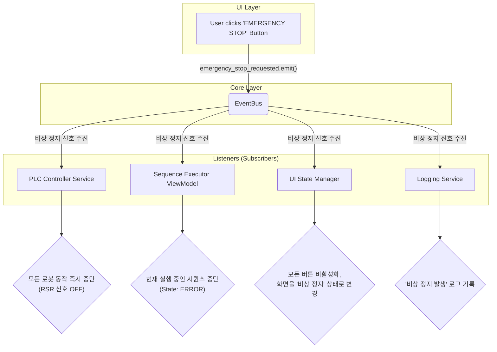

# 비상 정지 (EMERGENCY STOP) 플로우 차트

이 문서는 '비상 정지' 버튼 클릭 시 발생하는 이벤트 흐름을 설명합니다.

## 🚨 설계 핵심: EventBus를 통한 전역 방송

비상 정지는 특정 모듈 하나가 아닌, 시스템의 여러 부분이 동시에 알아야 하는 매우 중요한 **전역 이벤트**입니다. 따라서 중앙 방송국 역할을 하는 `EventBus`를 통해 "비상 정지 발령!"이라는 신호를 모든 모듈에 한 번에 전파(Publish)하는 것이 가장 효율적이고 안전한 방식입니다.

각 모듈은 이 방송을 듣고(Subscribe), 각자 맡은 역할에 따라 비상 정지 절차를 수행합니다.

## 🔄 로직 흐름 (Flowchart)

