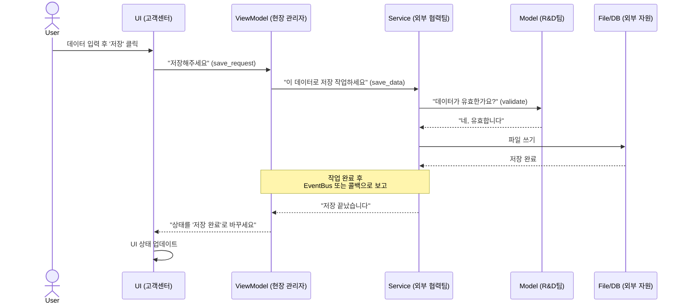

# 애플리케이션 로직 흐름 설계

## 📂 폴더 구조와 역할 비유

```
KRISS_ROBOT_SYNC/
├── ui/          # 🏢 1. 고객센터 (View)
├── view_models/ # 🧠 2. 현장 관리자 (ViewModel)
├── services/    # 🚚 3. 외부 협력팀 (Service)
├── models/      # 🔬 4. 연구개발(R&D)팀 (Model)
└── ...
```

### 예시: 사용자가 '매크로 저장' 버튼을 누를 때

1.  **🏢 고객센터 (`/ui`)**
    *   **역할**: 사용자와 직접 소통하는 창구. 사용자가 버튼을 누르거나 값을 입력하는 것을 가장 먼저 인지한다.
    *   **흐름**: 사용자가 '매크로 저장' 버튼을 누르면, 고객센터 직원은 "저장 요청이 들어왔습니다!"라고 즉시 **현장 관리자**에게 보고. 고객센터는 복잡한 처리 방법은 모릅니다.

2.  **🧠 현장 관리자 (`/view_models`)**
    *   **역할**: 고객센터의 보고를 받아 실제 작업을 지시하는 중간 관리자입니다. 어떤 일을 어떤 부서에 맡길지 결정합니다.
    *   **흐름**: '저장' 요청을 받은 현장 관리자는 "이건 파일 저장 작업이군. **외부 협력팀**에 맡겨야겠다"고 판단하고, 저장할 데이터를 정리해서 전달합니다.

3.  **🚚 외부 협력팀 (`/services`)**
    *   **역할**: 파일 저장, 네트워크 통신 등 회사 외부의 자원과 소통하는 전문 팀입니다.
    *   **흐름**: 파일 저장 요청을 받은 협력팀은, 저장할 데이터의 형식이 올바른지, 혹시 잘못된 값은 없는지 **연구개발팀**에 검토를 의뢰합니다.

4.  **🔬 연구개발(R&D)팀 (`/models`)**
    *   **역할**: 데이터의 구조를 정의하고, 순수한 계산 및 검증 로직을 수행하는 핵심 두뇌입니다. 외부 환경에 대해 전혀 알 필요가 없습니다.
    *   **흐름**: 전달받은 데이터가 프로젝트의 표준 규격(예: 좌표는 반드시 숫자여야 함)에 맞는지 검증하고 결과를 협력팀에 알려줍니다.

---

### 🤔 "왜 이렇게 복잡하게 만드나요?"

개발자가 아닌 사람이 보기에 이 구조는 간단한 파일 저장 하나 하는데 너무 많은 단계를 거치는 것처럼 보일 수 있습니다. 하지만 이는 **유지보수가 용이하고 안정적인 시스템**을 만들기 위한 표준적인 설계 방식입니다.

만약 이 모든 것을 파일 하나에 다 넣는다면, 다음과 같은 부작용이 발생합니다.

1.  **유지보수 문제**
    *   **비유**: 모든 부서 직원이 한 방에 모여 일하는 것과 같습니다. 파일 저장 방식을 바꾸려고 코드 한 줄 고쳤는데, 전혀 상관없는 화면 표시 기능이 고장 날 수 있습니다.
    *   **결과**: 버그를 잡기가 매우 어려워지고, 간단한 기능 추가에도 예상치 못한 곳에서 문제가 터져 개발 시간이 몇 배로 늘어납니다.

2.  **성능 문제**
    *   **비유**: 유능한 직원 한 명에게 모든 일을 시키는 것과 같습니다. 그 직원이 파일 저장이라는 오래 걸리는 일을 하는 동안, 다른 모든 업무(화면 클릭, 상태 표시 등)는 완전히 멈춰버립니다.
    *   **결과**: 사용자는 프로그램이 '먹통'이 되었다고 느끼게 되어 제품의 품질 신뢰도가 떨어집니다. (Worker를 두는 이유)

3.  **확장성 문제**
    *   **비유**: 특정 프로젝트만을 위해 특별 제작된 부품과 같습니다. 나중에 다른 프로젝트에서 '파일 저장' 기능이 필요할 때, 코드가 너무 복잡하게 얽혀 있어 해당 기능만 떼어내 재사용할 수가 없습니다.
    *   **결과**: 비슷한 기능을 만들 때마다 매번 처음부터 새로 개발해야 하므로 비효율적입니다.

> **결론적으로, 지금의 '복잡해 보이는' 설계는 각 부품(모듈)이 맡은 역할에만 집중하게 하여, 문제가 생겼을 때 원인 파악을 쉽게 하고, 다른 부분에 영향을 주지 않으면서 기능을 수정하거나 추가할 수 있도록 만드는 '잘 정리된 공장'과 같습니다.**

## 🔄 일반적인 로직 흐름 (Flowchart)


